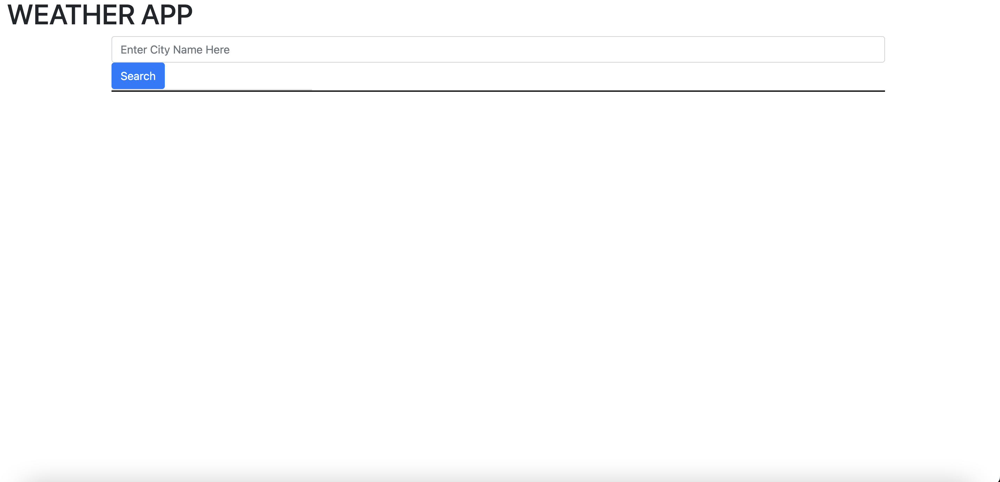

# weather-app

Development on hold:

## About this app

This application was designed to allow the user to check the current and future (5 day) weather conditions of any city that they search for. The application has a search bar where users can type what city they'd like to search and then the application will display the temperature, humidity, wind speed, and UV index with a color coded box that spans from green to yellow to red based on the intensity of the index. Previous searches will be stored and displayed in a sidebar on the left hand side allowing users to click on a previous query and return to that weather data.

## Screencap

## Functionality

User may enter text into the input form that states "Enter City Name Here" in and then click on the submit button which will send a request to the API to pull the weather data for that location. It will store the city name into local storage and then pull that name from the local storage and display it as a button element on the left hand sidebar which will then be clickable to return the user to previously searched city weather information. The weather is displayed for current day and as a 5 day forecast for entered city.

## Contributions

Contributions are not currently accepted as production of application is on hiatus. Production and contributions to application may continue at a later date.

## live link to current production state

https://stumartin22.github.io/weather-app/

## link to author's github

https://github.com/StuMartin22